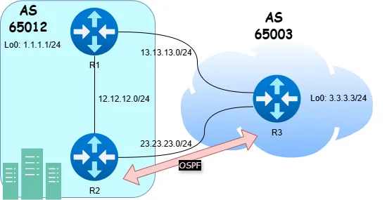

# eBGP vs. iBGP vs. OSPF

## Objetivos de Aprendizado

Desafio levantado durante entrevista de emprego. Verificar desempate entre BGP e outros protocolos (OSPF) no cisco.

<div data-node-type="callout">
<div data-node-type="callout-emoji">💡</div>
<div data-node-type="callout-text"><strong>Pergunta:</strong> Um roteador aprende um prefixo x.x.x.x/x de três formas diferentes (eBGP, iBGP com LP 400 e via OSPF) qual rota será instalada na tabela de roteamento?</div>
</div>

## Topologia



## Introdução

Este laboratório explora a interação entre eBGP, iBGP e OSPF em um ambiente de roteamento multiprotocolo. Você irá:

* Estabelecer sessões BGP para anunciar rotas.
    
* Manipular atributos BGP para influenciar a seleção de caminhos.
    
* Integrar OSPF para observar a precedência de protocolos na tabela de roteamento.
    

**Conceitos principais**:

* **eBGP**: Usado entre ASNs diferentes, propaga rotas externamente.
    
* **iBGP**: Usado dentro do mesmo ASN, distribui rotas externas internamente.
    
* **OSPF**: Protocolo IGP que anuncia rotas com menor distância administrativa que o BGP.
    

---

## Tarefa 1: Configurar eBGP e Anunciar Loopback

**Objetivo**: Estabelecer uma sessão eBGP entre R1 e R3 e anunciar o Loopback 0 do R3 (3.3.3.3/24) no BGP.

**Passos**:

1. Configure a sessão eBGP entre R1 (AS65012) e R3 (AS65003).
    
2. No R3, anuncie o Loopback 0 no BGP usando o comando `network`.
    
3. Verifique a sessão BGP e a tabela de rotas no R1.
    

**Comandos**:

```bash
autonetops task 1 --show  # Exibe a configuração
autonetops task 1        # Aplica a configuração
```

**Verificação**:

* No R1: `show ip bgp | include 3.3.3.3` para confirmar que a rota foi aprendida.
    
* No R3: `show ip bgp summary` para verificar se a sessão está ativa.
    

<div data-node-type="callout">
<div data-node-type="callout-emoji">💡</div>
<div data-node-type="callout-text"><strong>Pergunta</strong>: Por que é necessário especificar a máscara exata no comando <code>network</code> para anunciar o Loopback?</div>
</div>

---

## Tarefa 2: Configurar iBGP entre R1 e R2

**Objetivo**: Estabelecer uma sessão iBGP entre R1 e R2 (ambos no AS65012) para propagar a rota do Loopback 0 do R3.

**Passos**:

1. Configure a sessão iBGP entre R1 e R2, preferencialmente usando interfaces Loopback.
    
2. Garanta que R1 propague a rota aprendida do R3 para o R2.
    
3. Verifique a sessão iBGP e a propagação da rota.
    

**Comandos**:

```bash
autonetops task 2 --show  # Exibe a configuração
autonetops task 2        # Aplica a configuração
```

**Verificação**:

* No R2: `show ip bgp | include 3.3.3.3` para confirmar o recebimento da rota.
    
* No R1: `show ip bgp neighbors` para verificar a sessão iBGP.
    

<div data-node-type="callout">
<div data-node-type="callout-emoji">💡</div>
<div data-node-type="callout-text"><strong>Pergunta</strong>: Por que o comando <code>next-hop-self</code> é frequentemente usado em configurações iBGP?</div>
</div>

---

## Tarefa 3: Alterar Local Preference para Preferência de Rota

**Objetivo**: Modificar o Local Preference (LP) no R1 para rotas aprendidas do R3, garantindo que o R2 prefira o caminho via R1 para o tráfego destinado a 3.3.3.3/24.

**Passos**:

1. No R1, aplique uma route-map para definir um Local Preference mais alto (ex.: 400) para rotas do R3.
    
2. Verifique que a tabela BGP do R2 mostra o caminho via R1 como o melhor.
    

**Comandos**:

```bash
autonetops task 3 --show  # Exibe a configuração
autonetops task 3        # Aplica a configuração
```

**Verificação**:

* No R2: `show ip bgp 3.3.3.3` para verificar o Local Preference e o melhor caminho.
    
* No R2: `traceroute 3.3.3.3` para confirmar que o tráfego passa pelo R1.
    

<div data-node-type="callout">
<div data-node-type="callout-emoji">💡</div>
<div data-node-type="callout-text"><strong>Pergunta</strong>: Como o Local Preference afeta a seleção de rotas no iBGP em comparação com o eBGP?</div>
</div>

---

## Tarefa 4: Integrar OSPF e Verificar Anúncio de Rota

**Objetivo**: Configurar OSPF entre R2 e R3 (Área 0) e garantir que o Loopback 0 do R3 seja anunciado com a máscara correta (/32).

**Passos**:

1. Habilite o OSPF nas interfaces entre R2 e R3, configurando-as na Área 0.
    
2. No R3, redistribua o Loopback 0 no OSPF ou anuncie-o diretamente com a máscara /24.
    
3. Verifique a adjacência OSPF e o anúncio da rota.
    

**Comandos**:

```bash
autonetops task 4 --show  # Exibe a configuração
autonetops task 4        # Aplica a configuração
```

**Verificação**:

* No R2: `show ip ospf neighbor` para confirmar a adjacência.
    
* No R2: `show ip route ospf | include 3.3.3.3` para verificar a rota com máscara /32.
    

<div data-node-type="callout">
<div data-node-type="callout-emoji">💡</div>
<div data-node-type="callout-text"><strong>Pergunta</strong>: Por que a distância administrativa do OSPF (110) pode sobrescrever rotas BGP (20 para eBGP, 200 para iBGP) na tabela de roteamento?</div>
</div>